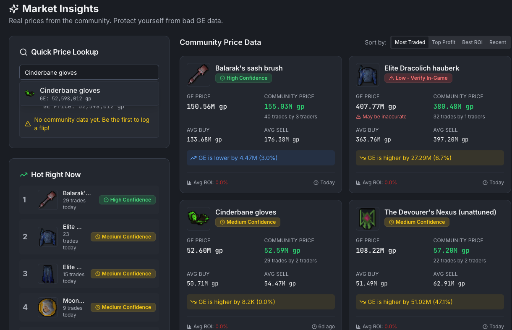

[README.md](https://github.com/user-attachments/files/29591832/README.md)
# RS3 Flip Tracker

RS3 Flip Tracker, also branded as FlipSync, is a RuneScape 3 Grand Exchange tracking app for logging flips, reviewing profit, and spotting better trading opportunities. It combines live market data, OCR, AI-assisted suggestions, and portfolio tracking in one place.

## What it does

- Log buy and sell flips with item metadata, dates, notes, and strategy tags
- Track profit, ROI, hold time, and trade history over time
- Pull live item data and price history from the WeirdGloop GE API
- Scan screenshots with OCR to help capture flip data faster
- Show portfolio value, open positions, goals, and performance charts
- Send Discord summaries and alerts when configured
- Generate AI-driven suggestions based on trading patterns and market history

## Tech Stack

- Frontend: React 18, TypeScript, Wouter, TanStack Query, Tailwind CSS, shadcn/ui
- Backend: Node.js, Express, TypeScript
- Database: PostgreSQL with Drizzle ORM
- Integrations: WeirdGloop GE API, OpenAI, Discord webhooks, Tesseract OCR

## Getting Started

### Prerequisites

- Node.js 18 or newer
- A PostgreSQL database
- Optional: OpenAI API key, Discord webhook, Replit auth config

### Install

```bash
npm install
```

### Environment Variables

Create a `.env` file with the values your deployment needs:

```bash
DATABASE_URL=your_postgres_connection_string
SESSION_SECRET=your_session_secret
PORT=5000
OPENAI_API_KEY=your_openai_api_key
DISCORD_WEBHOOK_URL=your_discord_webhook_url
REPL_ID=your_replit_app_id
ISSUER_URL=https://replit.com/oidc
```

Not every variable is required for local development, but `DATABASE_URL` is required by the server.

### Run Locally

```bash
npm run dev
```

### Build

```bash
npm run build
```

### Type Check

```bash
npm run check
```

## Project Structure

- `client/` - React app and UI components
- `server/` - API routes, auth, storage, integrations, and OCR
- `shared/` - Shared schema and utility logic
- `attached_assets/` - Branding, screenshots, and media

## Screenshots



## Notes

- The app uses live Grand Exchange data and local trade history to surface insights.
- Some features, like AI suggestions and Discord notifications, depend on optional environment variables.
- The project was originally built for Replit, but it runs as a standard Node and Vite app.
